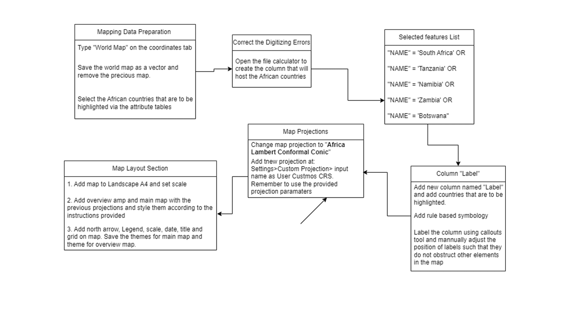
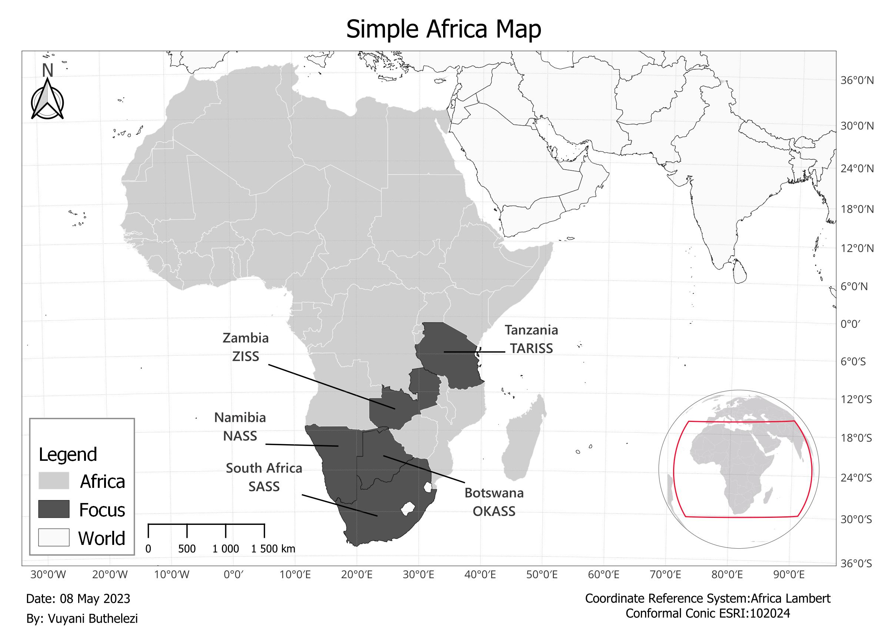

 
# Week one and two
Tasks for the first two weeks:

1. Make a Simple Africa map for journal article
2. Sign up to GitHub, fork the repo and add changes or recommendations to the Handbook cartography guideline
3. Contribute to OSM and HOT tasks 

## Simple Africa Map:
 

Kartoza references relating to this project:
1. QGIS Road to Nerdvana Episode 15: Making a small scale map of Africa:
https://www.youtube.com/watch?v=LJIiZfA7Iio
2. Modules 3, 5 and 6 (Symbology, Labelling and Composer)

## Github Exercise:
1. Fork the Handbook
2. Clone Repo and open on VS code
3. Add the cartography guidelines on the markdown (Follow markdown syntax)
4. To view markdown easily, install Markdown PDF or Markdown All in One and use Ctrl+Shift+V or ‘preview’ icon to see the changes you added in a markdown format
5. Save work and make a pull request

## OSM:
1. Login to account
2. Use search bar to navigate to AOI.
3. Edit> Edit by id
4. If editing polygons, choose area and trace the boundaries and add a tag. Insert ‘Yes’ if you do not know what kind of building the digitised building is, otherwise select from the drop down.
5. Save your work every 10/20 edits with a meaningful name.
